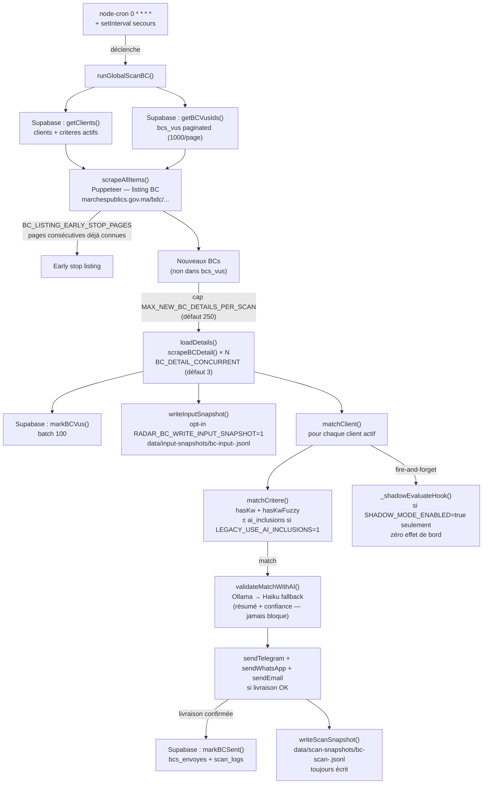
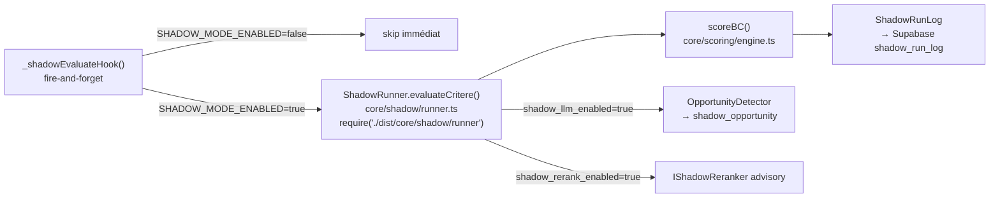
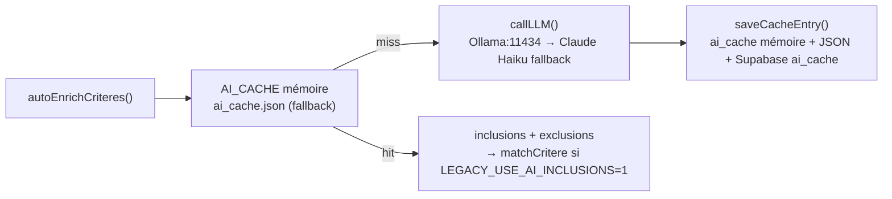
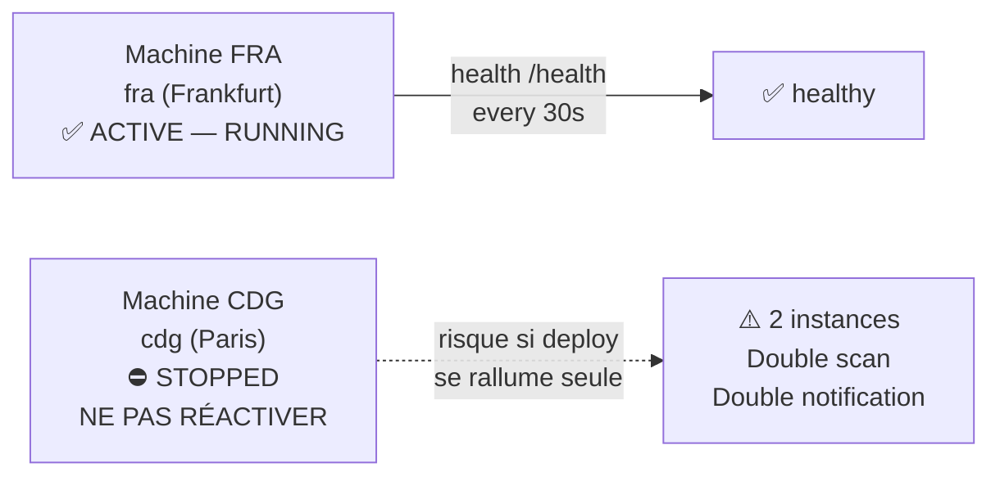

# ARCHITECTURE_RADAR_BC.md

> **Document de référence — état réel au commit courant (`ccb6184`)**
> Seul `radar-bc-bot.js` tourne en production. Tout ce qui est dans `core/` est
> expérimental ou en préparation. Ne pas confondre les deux strates.

---

## Table des matières

1. [Vue d'ensemble](#1-vue-densemble)
2. [Schéma des flux](#2-schéma-des-flux)
3. [Données persistantes](#3-données-persistantes)
4. [Déploiement Fly.io](#4-déploiement-flyio)
5. [Variables d'environnement](#5-variables-denvironnement)
6. [Règles anti-régression](#6-règles-anti-régression)
7. [Checklists](#7-checklists)
8. [Dette technique et risques ouverts](#8-dette-technique-et-risques-ouverts)

---

## 1. Vue d'ensemble

### 1.1 Deux strates coexistantes

```
┌─────────────────────────────────────────────────────────────────────┐
│  PRODUCTION (seul fichier qui s'exécute sur Fly.io)                │
│  radar-bc-bot.js  ←  Node.js 18 + Puppeteer + node-cron            │
│  Scrape marchespublics.gov.ma, matche les critères clients,         │
│  envoie les notifications Telegram/WhatsApp/Email.                  │
└─────────────────────────────────────────────────────────────────────┘

┌─────────────────────────────────────────────────────────────────────┐
│  EXPÉRIMENTAL / SHADOW / REVIEW  (hors prod en V1)                 │
│  core/  ←  TypeScript, compilé vers dist/ si tsc build:core        │
│  scoring, pipeline, shadow, onboarding, ai — jamais appelés en     │
│  prod sauf si SHADOW_MODE_ENABLED=true (off par défaut).           │
│  Tests unitaires Jest : 394/394 verts (coverage de la logique TS). │
└─────────────────────────────────────────────────────────────────────┘
```

### 1.2 `radar-bc-bot.js` — production

Fichier monolithique ~5 200 lignes. Responsabilités :

- **Scheduler** : `node-cron` toutes les heures (`0 * * * *` UTC) + `setInterval` de secours (60 s, détection UTC minute===0)
- **Scraping** : Puppeteer headless + Stealth sur `marchespublics.gov.ma` (session authentifiée)
- **Matching legacy** : `matchCritere()` → `hasKw()` + `hasKwFuzzy()` (Levenshtein ≤ 2)
- **Enrichissement IA** : Ollama local (prioritaire) ou Claude Haiku (fallback), résultats cachés dans `ai_cache`
- **Notifications** : Telegram Bot API, WhatsApp via provider, Email via Resend
- **Persistance** : Supabase (PostgreSQL) via REST/PostgREST — pas de SDK
- **Serveur HTTP** : health check `/health`, endpoints debug/admin sur `0.0.0.0:3000`
- **Snapshots locaux** : JSONL optionnels pour audit offline (`data/scan-snapshots/`, `/tmp/` sur Fly)
- **Shadow hooks** : appels fire-and-forget vers `core/shadow/runner.ts` si `SHADOW_MODE_ENABLED=true` (off par défaut)

### 1.3 `core/` — expérimental

| Sous-dossier | Rôle | Statut |
|---|---|---|
| `core/schemas/` | Types Zod (BC, Client, Scoring, Feedback, Notification) | Stable, testé |
| `core/scoring/` | Moteur de scoring explicable (`scoreBC`, `matchers`) | Stable, testé |
| `core/pipeline/` | Parser mock + classifier mock + runner — pipeline de test | Stable, testé |
| `core/shadow/` | Shadow Runner : évalue le core en parallèle du legacy, zéro effet de bord | En review, pas en prod |
| `core/onboarding/` | Pipeline d'onboarding client (intake → profil → critères) | En développement |
| `core/ai/` | Couche LLM typed (enricher, classifier, reranker, opportunity detector) | En développement |
| `core/feedback/` | Types feedback (pondération dynamique future) | Types seulement |

**Règle d'or** : `core/` ne peut PAS modifier `radar-bc-bot.js`. Seuls des hooks
fire-and-forget appelés depuis le bot peuvent activer le shadow — et uniquement
si `SHADOW_MODE_ENABLED=true`.

---

## 2. Schéma des flux

### 2.1 Flux principal BC (production)



### 2.2 Flux shadow (expérimental, off en prod)



### 2.3 Flux enrichissement IA (au démarrage du scan)



### 2.4 Snapshots

```
                           défaut Fly.io
RADAR_BC_SNAPSHOT_DIR=/tmp/radar-bc-snapshots
                              │
                 ┌────────────┴────────────┐
                 │                         │
      scan-snapshots/               input-snapshots/
   bc-scan-<timestamp>.jsonl      bc-input-<ts>.jsonl
   (toujours écrit)               (opt-in: RADAR_BC_WRITE_INPUT_SNAPSHOT=1)
   décisions matching              BC bruts AVANT matching
   client/critere/matched          (pour audit pipeline)

⚠️  /tmp sur Fly.io = RAM tmpfs.
    Perdu à chaque redémarrage de machine, rollback image, ou scale-to-zero.
    Aucun bucket S3 / volume Fly configuré actuellement.
```

---

## 3. Données persistantes

### 3.1 Tables Supabase utilisées

| Table | Usage | Pagination |
|---|---|---|
| `clients` | Clients actifs + leurs critères (JOIN) | Non paginé (supposé < 1000) |
| `criteres` | Critères de matching par client (PATCH ai_inclusions) | Via JOIN clients |
| `bcs_vus` | IDs + données des BC déjà vus (dédup listing) | Paginé `sbFetchAllPages` 1000/page |
| `bcs_envoyes` | Historique notifications BC et MP par client | Lecture simple (limit implicite) |
| `mps_vus` | IDs + données des MP vus (`limit=20000` hardcodé) | ⚠ Pas paginé — risque futur |
| `ai_cache` | Cache enrichissements LLM (inclusions/exclusions) | Chargement complet au démarrage |
| `scan_logs` | Compteurs nb_analyses/nb_trouves/nb_nouveaux par client | Écriture seule |
| `shadow_run_log` | Logs shadow runner (expérimental) | Écriture seule |
| `shadow_opportunity` | Opportunités cachées détectées par le shadow | Écriture seule |
| `client_feedback_events` | Feedback utilisateur (expérimental) | Écriture seule |

### 3.2 Ce qui n'est PAS persistant

- **Snapshots** (`data/scan-snapshots/`, `data/input-snapshots/`, `/tmp/`) : volatils, perdus au redémarrage Fly
- **`ai_cache.json`** (fichier local) : dans `/app` sur Fly = image Docker → perdu au redémarrage sauf si dans un volume Fly (non configuré)
- **`AI_CACHE` mémoire** (Map JS) : perdu à chaque restart
- **`VALIDATION_CACHE`** (Map JS par scan) : remis à zéro à chaque scan

### 3.3 Risque snapshot non-persistant

Sur Fly.io, `/tmp` est un tmpfs monté en RAM — il est **vidé à chaque restart de machine** (deploy, crash, scale-to-zero). Sans volume Fly ou export externe, les snapshots JSONL ne survivent pas :

- `/api/snapshot/latest` retourne toujours un snapshot vide après redémarrage
- Les snapshots d'input (`RADAR_BC_WRITE_INPUT_SNAPSHOT=1`) se perdent
- Le debug offline des décisions de matching est impossible après un restart

**Mitigation actuelle** : la logique de matching reste dans le bot (pas dans les snapshots) — les snapshots sont de l'observation, pas de la persistence critique.

---

## 4. Déploiement Fly.io

### 4.1 Configuration actuelle

```toml
# fly.toml — extrait
app            = "radar-bc-bot"
primary_region = "fra"

[http_service]
  internal_port        = 3000
  force_https          = true
  auto_stop_machines   = "off"      # Machines ne s'arrêtent pas
  min_machines_running = 1

  [[http_service.checks]]
    path    = "/health"
    interval = "30s"
    timeout  = "10s"

[[vm]]
  memory   = "1gb"
  cpu_kind = "shared"
  cpus     = 1
```

### 4.2 Machines



| Machine | Région | État attendu | Action si elle redémarre |
|---|---|---|---|
| `fra` | Frankfurt | **RUNNING** | Normal |
| `cdg` | Paris | **STOPPED** | `fly machine stop <id-cdg>` immédiatement |

### 4.3 Risques au déploiement

1. **CDG se rallume** : `fly deploy` peut réactiver les machines stoppées selon la stratégie de rolling deploy. Vérifier avec `fly machine list` après chaque deploy.
2. **Rollback image différente** : si le deploy échoue partiellement, une machine peut rester sur l'ancienne image. Vérifier `fly machine list` et les versions d'image.
3. **Secrets absents** : si `SUPABASE_URL`, `SUPABASE_KEY` ou `TELEGRAM_BOT_TOKEN` sont absents, le bot démarre mais les scans échouent silencieusement ou les notifications sont impossibles.
4. **Snapshots perdus** : tout `/tmp` vidé au redémarrage — prévu, non bloquant.
5. **ai_cache.json perdu** : le fallback JSON local disparaît ; Supabase recharge le cache au prochain démarrage.

---

## 5. Variables d'environnement

### 5.1 Obligatoires (production bloquée sans elles)

| Variable | Usage | Valeur attendue |
|---|---|---|
| `SUPABASE_URL` | Endpoint Supabase PostgREST | `https://<project>.supabase.co` |
| `SUPABASE_KEY` | Clé anon Supabase (RLS activé) | JWT anon (pas service_role) |
| `TELEGRAM_BOT_TOKEN` | Token bot Telegram | Format `1234567890:ABCdef...` |

### 5.2 Notifications optionnelles

| Variable | Usage | Défaut |
|---|---|---|
| `RESEND_API_KEY` | Email via Resend | Absent = email désactivé |
| `FROM_EMAIL` | Expéditeur email | `radar@radarmarchesmaroc.ma` |
| `ANTHROPIC_API_KEY` | Claude Haiku (fallback LLM) | Absent = LLM désactivé |
| `OLLAMA_URL` | LLM local Ollama (prioritaire) | Absent = Ollama désactivé |
| `OLLAMA_MODEL` | Modèle Ollama | `qwen2.5:32b` |

### 5.3 Comportement du scan

| Variable | Usage | Défaut |
|---|---|---|
| `BC_LISTING_EARLY_STOP_PAGES` | Arrêt listing si N pages consécutives 100% connues | 0 (désactivé) |
| `BC_DETAIL_CONCURRENT` | Parallélisme chargement fiches BC | 3 (max 6) |
| `MAX_NEW_BC_DETAILS_PER_SCAN` | Cap fiches chargées par scan | 250 (0 = illimité) |
| `STARTUP_BC_SCAN_DELAY_MS` | Délai premier scan après démarrage | Variable (auto) |
| `RADAR_BC_SERVER_ONLY` | Désactive cron + scan initial (tests locaux) | `0` |

### 5.4 Snapshots et debug

| Variable | Usage | Défaut |
|---|---|---|
| `RADAR_BC_SNAPSHOT_DIR` | Répertoire base des snapshots | `data/` (local) ou `/tmp/radar-bc-snapshots` (Fly) |
| `RADAR_BC_WRITE_INPUT_SNAPSHOT` | Active snapshot input BC avant matching | `0` (désactivé) |
| `RADAR_BC_MATCH_SHADOW` | Active ancienne comparaison shadow locale (différente du shadow runner TS) | `0` |
| `RADAR_BC_LEGACY_USE_AI_INCLUSIONS` | Matching legacy utilise ai_inclusions | `0` (désactivé — conservateur) |

### 5.5 Shadow runner (expérimental — prod = off)

| Variable | Usage | Défaut prod |
|---|---|---|
| `SHADOW_MODE_ENABLED` | Active le shadow runner core TS | `false` (**ne pas activer en prod**) |
| `SHADOW_MODE_EMERGENCY_KILL` | Kill switch immédiat shadow | `false` |
| `SHADOW_LLM_ENABLED` | Active LLM dans le shadow | `false` |
| `SHADOW_CLIENT_FILTER` | Filtre client shadow | `all` |
| `SHADOW_BC_SAMPLE_RATE` | Taux échantillonnage BC shadow | `0.1` |
| `SHADOW_OPPORTUNITY_MAX` | Max opportunités loggées par BC | `5` |

### 5.6 Portail (optionnel — pack avancé)

| Variable | Usage |
|---|---|
| `PORTAL_LOGIN` | Login marchespublics.gov.ma |
| `PORTAL_PASSWORD` | Mot de passe portail |

---

## 6. Règles anti-régression

Ces règles ont été établies après des incidents réels et doivent être respectées à chaque intervention.

### 6.1 Règles absolues

```
❌ NE JAMAIS activer SHADOW_MODE_ENABLED=true en prod sans validation staging complète
❌ NE JAMAIS faire git add . — toujours stager explicitement fichier par fichier
❌ NE JAMAIS modifier le scheduler (cron.schedule) sans les 394 tests verts
❌ NE JAMAIS modifier matchCritere() / hasKw() / hasKwFuzzy() pendant un patch snapshot
❌ NE JAMAIS déployer avec des tests rouges
❌ NE JAMAIS activer LEGACY_USE_AI_INCLUSIONS sans avoir vérifié les ai_inclusions en BDD
❌ NE PAS push ni deploy sans instruction explicite
```

### 6.2 Règles de sécurité code

```
✅ Toute modification de core/ doit être couverte par un test Jest
✅ Toute modification de radar-bc-bot.js doit passer node --check radar-bc-bot.js
✅ Les hooks shadow sont fire-and-forget : une erreur shadow ne doit jamais bloquer le legacy
✅ La clé Supabase utilisée est ANON (pas service_role) — RLS protège les données
✅ Les notifications sont conditionnelles à la livraison réelle (sendTelegram retourne boolean)
✅ markSent() n'est appelé que si au moins une livraison a réussi
```

### 6.3 Invariants scoring

```
✅ Le scoring core/scoring/engine.ts est déterministe (pas d'appel LLM)
✅ Un BC vide (objet vide, bodyText vide, 0 articles) → score = 0 (guard early return)
✅ scoreBusinessIntentComponent retourne 8 pour 'unknown' (neutre, pas zéro)
✅ article_score = min(40, round(bestStrength × density))
✅ Les décisions notify/rerank/ignore reposent sur final_score vs seuils fixes (pas LLM)
```

---

## 7. Checklists

### 7.1 Avant push

```
□ node --check radar-bc-bot.js → syntaxe OK
□ npx jest --runInBand → 394/394 verts
□ git diff --stat pour confirmer les fichiers modifiés
□ git status pour vérifier absence de fichiers non stagés non désirés
□ Aucun secret ne doit apparaître dans le diff
□ Aucune modification du scheduler
□ Aucune modification du matching legacy (sauf intention explicite)
```

### 7.2 Avant deploy (`fly deploy`)

```
□ Tests verts (394/394)
□ node --check radar-bc-bot.js
□ Vérifier fly.toml : auto_stop_machines = "off", min_machines_running = 1
□ Vérifier que les secrets sont présents : fly secrets list
□ Confirmer SHADOW_MODE_ENABLED absent ou = false dans fly secrets
□ Identifier les machines actives AVANT : fly machine list
□ Préparer la commande stop CDG si elle se rallume
```

### 7.3 Après deploy

```
□ fly machine list → vérifier que CDG est STOPPED
□ fly logs --app radar-bc-bot → vérifier démarrage sans erreur
□ curl https://radar-bc-bot.fly.dev/health → {"status":"ok"}
□ curl https://radar-bc-bot.fly.dev/api/status → vérifier uptime + lastScan
□ Attendre le premier scan (max 1h) ou déclencher /api/scan-now
□ Vérifier logs scan : "SCAN BC", "client(s) BC actif(s)", "Aucune erreur"
□ Vérifier absence de "Supabase KO", "Erreur", "failed"
□ Vérifier les notifications si des nouveaux BC doivent arriver
```

### 7.4 Rollback

```
□ fly releases --app radar-bc-bot → identifier la release précédente
□ fly deploy --image <image-précédente> (ou fly rollback si disponible)
□ Après rollback : vérifier fly machine list → CDG toujours STOPPED
□ Vérifier /health et /api/status
□ Si CDG s'est rallumée : fly machine stop <id-cdg> immédiatement
□ Identifier la cause du problème avant tout nouveau deploy
```

---

## 8. Dette technique et risques ouverts

### 8.1 Risques critiques

| Risque | Probabilité | Impact | Mitigation actuelle |
|---|---|---|---|
| CDG se rallume au deploy | Haute | Élevé (double scan, double notif) | Checklist post-deploy, `fly machine stop` manuel |
| Snapshots perdus au restart | Certaine | Moyen (audit seulement) | Accepté, non bloquant |
| `ai_cache.json` perdu au restart | Certaine | Faible (Supabase recharge) | Cache Supabase comme source de vérité |
| `mps_vus` non paginé (`limit=20000`) | Moyenne si MP activé | Élevé | MP désactivé (`FEATURES.enableMP=false`) en V1 |
| Token Telegram invalide | À vérifier | Élevé (0 notifications) | `_isValidToken()` au démarrage, log `tg_token=empty` |

### 8.2 Dette technique identifiée

**Snapshots non persistants**
- Les snapshots JSONL dans `/tmp` ou `data/` ne survivent pas aux redémarrages Fly
- Solution future : volume Fly.io monté sur `/data`, ou export vers Supabase Storage / S3
- Impact immédiat : nul (les snapshots sont de l'observation, pas de la logique)

**Pagination `mps_vus`**
- `sbReq("mps_vus?select=mp_id&limit=20000")` — limite hardcodée, non paginée
- Risque si MP est réactivé et que `mps_vus` dépasse 20 000 lignes
- Fix : utiliser `sbFetchAllPages` comme pour `bcs_vus`

**Séparation legacy / core à clarifier**
- `radar-bc-bot.js` contient un "shadow" local (`RADAR_BC_MATCH_SHADOW=1`) différent du `core/shadow/runner.ts`
- Les deux mécanismes shadow coexistent avec des variables d'env distinctes — risque de confusion
- Le shadow runner TS (`SHADOW_MODE_ENABLED`) nécessite `dist/` compilé — absent de l'image Docker actuelle (pas de `build:core` dans le Dockerfile)

**`dist/` absent du Dockerfile**
- `core/shadow/runner.ts` est `require('./dist/core/shadow/runner')` dans le bot
- Le Dockerfile ne lance pas `npm run build:core` — donc `dist/` n'existe pas sur Fly
- Conséquence : le shadow runner TS est inactif même si `SHADOW_MODE_ENABLED=true` (le `require` échoue silencieusement, `_shadowRunnerInstance = null`)
- Solution avant activation shadow en prod : ajouter `RUN npm run build:core` au Dockerfile

**Tests pipeline à maintenir**
- `tests/unit/pipeline.test.ts` : les seuils de score ont été ajustés pour coller au moteur réel (F3: 54, F5: 47, F4: 20)
- Si le moteur de scoring `core/scoring/engine.ts` change, les seuils doivent être recalculés
- Toujours relancer `npm test -- --runInBand` après toute modification de `engine.ts`

**`ai_cache.json` commité**
- `ai_cache.json` est tracké par git mais contient des données de cache LLM
- Risque de divergence entre cache git et cache Supabase
- Solution : ajouter `ai_cache.json` à `.gitignore`

### 8.3 Ce qui fonctionne correctement

```
✅ Scan BC toutes les heures (node-cron + setInterval secours)
✅ Scraping Puppeteer avec stealth (contourne les protections portail)
✅ Matching legacy hasKw + fuzzy Levenshtein
✅ Notifications Telegram avec marquage conditionnel (markSent si livraison OK)
✅ Cache LLM Supabase (survit aux redémarrages via Supabase)
✅ Early stop listing (BC_LISTING_EARLY_STOP_PAGES)
✅ Cap fiches (MAX_NEW_BC_DETAILS_PER_SCAN=250)
✅ Pagination bcs_vus (sbFetchAllPages, 1000/page)
✅ Health check /health opérationnel
✅ 394/394 tests Jest verts
✅ Moteur scoring core/ déterministe et explicable
✅ Shadow runner TS isolé (zéro effet de bord garanti)
```

---

*Document généré à partir du code réel — commit `ccb6184` — `radar-bc-bot.js` ~5 200 lignes, `core/` ~50 fichiers TypeScript.*
